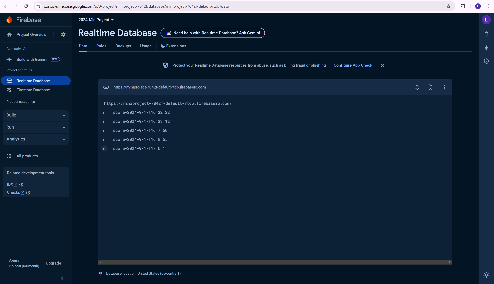
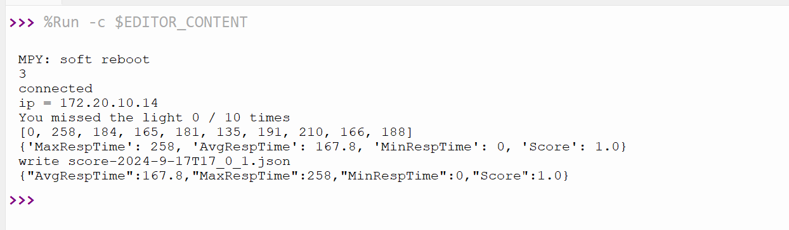
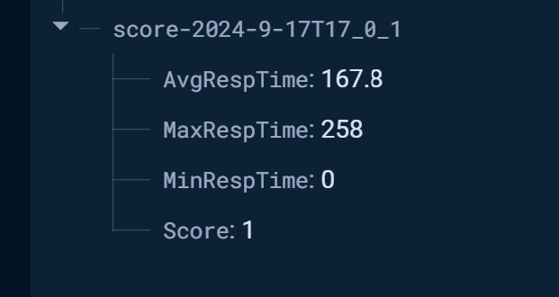

# Fall 2024 Mini Project Assignment by Astrid Mihalopoulos and Leyandra Burke
## Exercise 1
1.  what are the "max_bright" and "min_bright" values you found?
   min_bright = 46000
   max_bright = 2000

## Exercise 2
We started with the code in exercise_sound.py as a starting point. The original code had tones that descended for a set amount of time. We decided to play the Wii Theme music or the "Mii Song". We first found the frequency for each of the notes. That was done by finding the sheet music and matching the frequency to the note using the provided frequency website.

<p align="center">

</p>
<p align="center">
Sheet Music Used for "Mii Song"
</p>

Here are the frequencies for the notes 
##
Then we added the following code to play the song. We used the already existing playtone function. 
```python
playtone(370,.4)
playtone(440,.4)
playtone(554,.5)
playtone(440,.6)
playtone(370,.4)
playtone(294,.3)
playtone(15,.05)
playtone(294,.3)
playtone(15,.05)
playtone(294,.3)


playtone(554,.5)
playtone(294,.3)
playtone(370,.4)
playtone(440,.4)
playtone(554,.5)
playtone(440,.4)
playtone(370,.4)
playtone(330,.4)
playtone(311,.4)
playtone(294,.3)
```
The first part of the function is the frequency and the other is the duration the note will play. 

## Exercise 3
We edited the exercise_game.py code to calculate minimum, maximum and average response times. The following code was added 
The following code was added 

```python
  data = {
        "MinRespTime": min(t_good),
        "MaxRespTime": max(t_good),
        "AvgRespTime": (sum(t_good) / len(t_good)),
        "Score": 1- misses / len(t)
    }

    print(data)    
```

##
Since we need 10 flashes the variavle N was changed from 3 to 10 

# Upload to the cloud 
We decided to use Firebase to upload our data to the cloud. First we created a Firebase project. We then made a realtime database that would recieve the data in the form of a JSON file from the Raspberry Pi Pico. 

<p align="center">

</p>
<p align="center">
Firebase Realtime Database
</p> 
<p>
   
</p>


Then we connected our Pi Pico to the internet using the following code. 

```python
import time
import network

ssid="Ley"
password="Password" # Password Redacted

wlan = network.WLAN(network.STA_IF)
wlan.active(True)
wlan.connect(ssid, password)

max_wait = 100
while max_wait > 0:
    if wlan.status() < 0 or wlan.status() >=3:
        print(str(wlan.status()))
        break
    max_wait -= 1
    print('waiting for connection')
    time.sleep(1)

 #Handle connection error
if wlan.status() != 3:
    raise RuntimeError('network connection failed')
else:
    print('connected')
    status = wlan.ifconfig()
    print( 'ip = ' + status[0] )
```

We then combined the internet code with the excercise_game.py code so everytime it ran it would ensure that it was connected to the internet. 

Then after importing the urequests module we added the following code to send the data to the database. 

First by getting the reference url from the database and putting it as a global variable.

```python
DB_url = "https://miniproject-7042f-default-rtdb.firebaseio.com/"
```
Then adding this code into the write_json function which stores the JSON data directly into a file. Then uses the urequests module to send the data to the database and if it worked should print out the data sent.
```python
jason = json.dumps(data)

request = urequests.put(DB_url + json_filename, headers = {}, data = jason)  #Sends file 
print(request.text) #Prints what was sent
```
<p align="left">


</p>

<p align="center">
Data Output from Thonny Shell and Data Transferred to Firebase Cloud
</p> 

